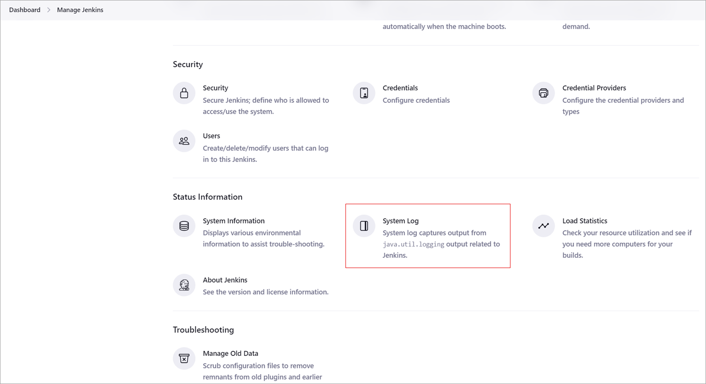

[](https://ci.appveyor.com/project/anuragsen/integrity-plugin)

This Jenkins plugin provides SCM integration capabilities to [Windchill RV&S](https://www.ptc.com/en/technologies/plm/requirements-management) for Configuration Management. 

### Overview

The Windchill RV&S Jenkins plugin has been qualified with Jenkins Java 11 supported versions. Older versions of this plugin may not be safe to use. Please review the following warnings before using an older version:

- [Arbitrary code execution vulnerability](https://jenkins.io/security/advisory/2017-04-10/)

The PTC Windchill RV&S CM - Jenkins Plugin is an open source plugin that provides Jenkins Integration build capabilities for [Windchill RV&S](https://www.ptc.com/en/technologies/plm/requirements-management).

The plugin provides the following capabilities:

- Supports creation of builds from any Windchill RV&S CM Project configuration (normal, variant, and build).
- Supports generation of continuous builds in Jenkins using file-based changes or transactional change package-based changes in Windchill RV&S.
- Supports integration with local Windchill RV&S client.
- Supports specifying a Sandbox scope for transfer of specific subprojects and/or members from the Windchill RV&S server to the Sandbox directory when the Sandbox is created or resynchronized.
- Tags support with a user defined tag name/pattern. For example:

  ```{.syntaxhighlighter-pre data-syntaxhighlighter-params="brush: java; gutter: false; theme: Confluence" data-theme="Confluence"}
  ${env['JOB_NAME']}-${env['BUILD_NUMBER']}-${new java.text.SimpleDateFormat("yyyy_MM_dd").format(new Date())}
  ```

  A tag refers to a Windchill RV&S CM Project Checkpoint with a project label and without propagation of the label to all members.

- Supports full or incremental workspace synchronization. The plugin provides the option for a clean workspace that deletes the current workspace and downloads a fresh copy from Windchill RV&S when enabled. If you do not enable the option for a clean workspace, the workspace is updated based on changes found in the Windchill RV&S repository.
- Provides a detailed change log of differences for the current build with an integrated SCM browser support. Change Log report links directly to Windchill RV&S CM Annotated Member and Differences views.
- Polls Windchill RV&S CM on a cron schedule to check for any changes. If there are changes, the plugin automatically initiates a build.
- Supports distributed/remote build execution. In a clustered Jenkins environment, this plugin is designed to execute the checkout operation on remote agents.
- Supports Workflow plugins for Jenkins. For more information, see [Jenkins Workflow Support](#jenkins-workflow-support).
- Provides the option to update a Windchill RV&S Build item with the results of the build. The plugin also provides the option to save the log contents to a rich text field.
- Provides the option to update a Windchill RV&S Test Session item with the results from a build's automated test execution.
- Updates Windchill RV&S project/sub-project with output from builds.

### Licensing

The PTC Windchill RV&S CM - Jenkins Plugin does not require any explicit license currently. However, the mksapi.jar used by the plugin (to connect to the Windchill RV&S server from Jenkins) is a proprietary PTC jar and hence has its own PTC license. Windchill RV&S users get this mksapi.jar and the license for this jar bundled with the Windchill RV&S server.

### Development

Being an open source software, the plugin follows all standards for being an open source software. The intention is to have a collaborative software development where developers across community can contribute to the plugin that benefits other users. PTC expects the community to contribute to the development of the plugin and developers can submit their code to the GitHub location as pull requests. The submissions are reviewed by PTC periodically and if deemed fit to be productized, PTC will merge the submissions into mainline and release as a new version of the plugin. PTC may, from time to time, contribute to the project as well.

### Assumptions

This document assumes that you know how to use Windchill RV&S and Jenkins. For more information on using Jenkins, refer to the [Jenkins documentation](https://wiki.jenkins-ci.org/display/JENKINS/Use+Jenkins). Click  next to the configuration fields in Jenkins for viewing the associated help.

### Installing PTC Windchill RV&S CM - Jenkins Plugin

#### Prerequisites

The installation of the PTC Windchill RV&S CM - Jenkins Plugin requires the following prerequisites:

- Jenkins 1.628 server or a later server is installed.
- PTC Integrity Lifecycle Manager 11.0 server or a later server is installed.
- API connections on the Windchill RV&S server are enabled.
- For local client integration, Windchill RV&S client is installed locally on Jenkins instances, including both controller and agents. For more information, see [PTC Windchill RV&S CM - Jenkins Plugin Local Client Integration](#ptc-windchill-rvs-cm---jenkins-plugin-local-client-integration).

**Note**

- _The plugin uses the API exclusively to communicate with the Windchill RV&S server._
- _The plugin does not require the Windchill RV&S client if local client integration is not used._
- _The plugin install package includes the mksapi.jar (4.16.7368), which is licensed under the PTC Freeware license. Please refer to ‘PTC Freeware License Agreement.docx’ located inside the mksapi.jar file._

Consider the following when attempting connection to an Integrity Lifecycle Manager 11.0 or a later server that is SSL-enabled:

- The Apache commons-httpclient library (jar) that is shipped with Jenkins 1.609.1 or later is incompatible with the same library that is packaged with the mksapi.jar.
- The version of commons-httpclient (packaged with the mksapi.jar) is older than the version that is shipped with Jenkins. See PTC Customer Support article [CS186156](https://support.ptc.com/appserver/cs/view/solution.jsp?n=CS186156) for details about the issue. If you encounter an issue as described in [JENKINS-31492](https://issues.jenkins-ci.org/browse/JENKINS-31492), ensure that you follow step 5 as described in the PTC Customer Support article [CS186156](https://support.ptc.com/appserver/cs/view/solution.jsp?n=CS186156).
- The incompatibility occurs only when attempting to connect to a SSL-enabled Windchill RV&S server. Do not attempt a jar swap of the commons-httpclient library, if your Windchill RV&S server is not SSL-enabled.

#### Installing the Plugin

To install the PTC Windchill RV&S CM - Jenkins Plugin:

1.  On the Jenkins dashboard, select **Jenkins \>** **Manage Jenkins \> Manage Plugins**.
      
    The **Plugin Manager** page opens.
2.  Select the **Available** tab.
3.  Navigate to the **Source Code Management** section and select the **PTC Windchill RV&S CM - Jenkins Plugin** checkbox.

    **Tip**
    
    _You can use the_ **_Filter_** _ield at the top-right corner of the_ **_Plugin Manager_** _page to search for_ **PTC Windchill RV&S CM - Jenkins Plugin**.
4.  Click **Install without restart** to directly install the plugin.
5.  Restart the Jenkins server after the plugin is installed.

#### Verifying a Successful Installation

Once you have installed the PTC Windchill RV&S CM - Jenkins Plugin, you can verify if the plugin installation is successful after restarting the Jenkins server.

To verify the plugin installation, click **Jenkins \>** **Manage Jenkins** \> **Configure System** on the Jenkins dashboard.


The presence of **Windchill RV&S** server configuration options validates the successful installation of the plugin.


You can create a list of the default Windchill RV&S server connection profiles using the **Windchill RV&S** server configuration options. You can select a Windchill RV&S server connection profile when you configure a build job or when you enable other post-build actions like **Windchill RV&S – Workflow Item**. See [Windchill RV&S Workflows and Documents Integration](#windchill-rvs-workflows--documents-integration) for more information on the **Windchill RV&S – Workflow Item** post-build action.

**Note**

- _The_ **_Advanced_** _button for_ **_Windchill RV&S Server Configurations_** _contains the default configuration for the Windchill RV&S server connection and SSL settings._
- _Ensure that you test the connection before saving the connection information._

### Configuring and Executing a Build Using the PTC Windchill RV&S CM - Jenkins Plugin

#### Configuring a Build

To configure a build:

1.  On the Jenkins dashboard, select any existing build configuration or create a new build job (as per your requirement). See the Jenkins documentation on how to create a new build job.
2.  Select **Configure**.
    
3.  Navigate to the **Source Code Management** section.
4.  Select **Windchill RV&S** to configure the settings for the PTC Windchill RV&S CM - Jenkins Plugin.
    
5.  Define the following **Windchill RV&S** settings:

    - In the **Server Configuration** field, select a connection profile.
      You can select a connection profile that you have defined as a part of the global server configurations for Windchill RV&S in the Jenkins configuration system settings.
    - In the **Windchill RV&S Project** field, specify the Windchill RV&S configuration management project or configuration path.
      You can specify a project using the old convention (specify full path to _project.pj_). However, when referencing a development path or a specific checkpoint, you must specify the configuration path convention. You can build multiple projects using the downstream jobs feature of Jenkins.

      **Note**

      _See the Windchill RV&S documentation or contact PTC Technical Support for details on how to obtain the configuration path for variant and build configurations._

    - Select the **Use Local Client** checkbox to enable local Windchill RV&S client integration point. When this checkbox is selected, the plugin does not use remote connections to the Windchill RV&S server. For more information on integration with local Windchill RV&S client, see [PTC Windchill RV&S CM - Jenkins Plugin Local Client Integration](#ptc-windchill-rvs-cm---jenkins-plugin-local-client-integration).
    - Clear the **Clean Workspace** checkbox (default setting) if you want to update an existing Jenkins workspace.
    - Select the **Use Change Package Mode** checkbox to enable the change package mode for the plugin. The **Change Package** mode enables the plugin to detect changes made using change packages on the Windchill RV&S server repository for generating the builds. By default, the plugin is configured to work in file-based changes mode and considers the file changes for generating the build. For more information on the Change Package mode, see [Change Detection](#change-detection).
      

6.  Click **Advanced** and define the following advance settings:

    - **Project Specific Username**
    - **Project Specific Password**
    - **Include List**
    - **Exclude List**
    - **Restore Timestamp**
    - **Line Terminator**
    - **Omit Author in Change Log**
    - **Checkpoint Before Build**

      **Note**

      _The plugin does not checkpoint Windchill RV&S CM build configurations. The plugin only checkpoints normal or variant configurations._

    - **Checkpoint Label**
    - **Alternate Workspace Directory**
    - **Synchronize Changed Workspace Files**

      **Note**

      _If you select the_ **_Synchronize Changed Workspace Files_** _checkbox, the plugin generates and store checksums for files in the workspace. When a build is executed either manually or due to a polling trigger, the plugin uses the checksums to synchronize any changed or deleted workspace files._

      _If a polling trigger detects no changes for the Windchill RV&S SCM project in the repository, but some workspace files are deleted or changed, then the workspace files are not synchronized. This behavior occurs since the checksum difference calculations are performed on the target file system (or agent). Hence, the only time the workspace is actually synchronized is during the start of the build (either manually or due to a change in the Windchill RV&S SCM project)._

    - **Delete Non Members**
    - **Checkout Thread Pool Size**
    - **Checkout Thread Timeout**
    - **Repository Browser**
    - **Sandbox Scope**

      A Sandbox scope determines which specific subprojects and/or members to transfer from the Windchill RV&S server to the Sandbox directory when the Sandbox is created or resynchronized. For more information about Sandbox scope, see the “_Specifying the Sandbox Scope_” topic in the _Windchill RV&S Help Center_ and the Windchill RV&S CLI man pages for _si createsandbox_ and _si configuresandbox_ commands.

      **Note**

      _To combine multiple Sandbox scope options using the logical AND operator, specify the AND operator twice. For example, to include project members with member attribute Beta AND name \*.java, specify attribute:Beta && name:\*.java in the **Sandbox Scope** field. This option is case-sensitive. Joining subproject scope clauses with a logical AND operator is not supported per Windchill RV&S._

    - **URL** (optional)

      **Note**

      _By default, the plugin defines a URL based on the specified host/port/secure parameters in the_ **_URL_** _field. However, you can specify the URL if you want to provide a different link for viewing the_ **_Annotated Revision_** _and_ **_Differences_** _views._
      _If you are running the Jenkins server on the same server as the Windchill RV&S Server (not recommended), then you need to override the value in the_ **_URL_** _field or access Jenkins using a different URL. Windchill RV&S CM links do not work if Jenkins and Windchill RV&S are running on the same server and/or are accessed with the same URL. However, you can access Jenkins with just the hostname, (for example,_ _[http://hostname:8080](http://hostname:8080/)\*\*) and Windchill RV&S with the fully qualified DNS name (for example,_ _[http://hostname.domain.com:7001](http://hostname.domain.com:7001/)\*\*). PTC recommends running the Windchill RV&S server and Jenkins on separate servers._
      

      **Note**

      _Click_  _next to the configuration fields for viewing the associated help._

7.  Optionally, if you want to poll Windchill RV&S CM for updates to your project, select the **Poll SCM** checkbox in the **Build Triggers** section and specify a schedule in the **Schedule** field.
    As shown in the following figure, Jenkins polls Windchill RV&S CM every five minutes.
    
8.  At the bottom of the Jenkins job configuration page, select **Add post-build action** \> **Windchill RV&S - CM Checkpoint**.
    

    **Note**

    _The plugin does not checkpoint Windchill RV&S CM build configurations. The plugin only checkpoints normal or variant configurations._

9.  In the **Checkpoint Label** field, define Groovy pattern for the Windchill RV&S CM checkpoint label.
    The plugin validates the string defined in the **Checkpoint Label** field for invalid label characters.
    

    **Note**

    _Jenkins administrators need to approve any potential unsecure groovy script before execution of the script defined in the **Checkpoint Label** field. For example, if you have a custom script evaluation in the above field, it needs to be approved using **Manage Jenkins** **\>** **In-process Script Approval** (URL: http://\<jenkins-instance\>:\<jenkins-port\>/scriptApproval), before the job configuration can be saved._

10. Click **Save** to commit your changes.

#### Executing a Build

To execute the build:

1.  On the Jenkins dashboard, select an existing build configuration (job).
2.  Select **Build Now** to start the build.
    If you configured your build job to use parameters (for example, Windchill RV&S Item ID), then select **Build with Parameters**.
    

If you want to check in artifacts from the build back into Windchill RV&S, specify how you are authorized to update the Windchill RV&S project using the **ItemID** parameter values.

Valid values for the **ItemID** parameter include:

```{.syntaxhighlighter-pre data-syntaxhighlighter-params="brush: java; gutter: false; theme: Confluence" data-theme="Confluence"}
:none    // Indicates no change packages are used for check in
:bypass  // Assumes that the user has administrative privileges to bypass change package policies configured for the Windchill RV&S Project
0        // Same as :none above
12345    // An actual valid Windchill RV&S Item ID that the plugin will use to create a change package
```

#### Monitoring Build Progress

To monitor the build progress:

1.  In the **Build History** widget, select the build that you initiated to monitor the progress.
    
2.  Click **Console Output**.
    The console output displays the details of the build in progress.
    

As highlighted in the above figure, if the **Clean Workspace** checkbox is not selected, the plugin attempts to update the workspace by performing the following operations:

- Downloading any changed files (includes adds/renames/moves)
- Dropping any files that are no longer needed (includes drops/renames/moves)

### Change Detection

After the installation of the PTC Windchill RV&S CM - Jenkins Plugin, the first build generated by Jenkins is considered as the initial build for reference. The plugin detects changes made to the files in the Windchill RV&S server repository and uses the file-based changes mode as the default mode for change detection. However, you can configure the plugin to detect changes that are part of the Windchill RV&S change packages and generate the builds in Jenkins based on the change packages detected.

For changes detected as part of change packages, the plugin considers only transactional closed state change packages in the Windchill RV&S server repository after the last successful build. If the existing build fails, the plugin considers the change packages that are in closed state after the last successful build, for the subsequent build.

#### Selection of File Mode or Change Package Mode

For creating the first build, the plugin obtains the latest version of the files from the Windchill RV&S server repository to the Jenkins workspace. You can then determine what change detection mode to use: File mode or Change Package mode for the subsequent builds. Select the Change Package mode for any change-package based changes in the Windchill RV&S server repository. For non-transactional change packages, retain the default File mode. For more information on the Windchill RV&S change packages, see the _PTC Windchill RV&S Help Center_.

### Tagging

A ‘tag’ refers to a Windchill RV&S CM Project checkpoint with a project label and without propagation of the label to all members. The PTC Windchill RV&S CM - Jenkins Plugin supports tagging with a user-defined tag name/pattern. For example:

```{.syntaxhighlighter-pre data-syntaxhighlighter-params="brush: java; gutter: false; theme: Confluence" data-theme="Confluence"}
${env['JOB_NAME']}-${env['BUILD_NUMBER']}-${new java.text.SimpleDateFormat("yyyy_MM_dd").format(new Date())}
```

You can configure tagging in the Jenkins build job under a post-build action. The following characters are not allowed in the **Checkpoint Label** field of a post-build action:

```{.syntaxhighlighter-pre data-syntaxhighlighter-params="brush: java; gutter: false; theme: Confluence" data-theme="Confluence"}
$
,
.
:
;
/
\
@
```

If you have configured the **Windchill RV&S - CM Checkpoint** post-build action correctly, then you can view an entry in the console output after successful completion of a build. 

If you have configured the **Windchill RV&S - CM Checkpoint** post-build action for a build configuration, the post-build action labels the project and does not attempt to create a new checkpoint. The post-build action performs a similar operation if you have configured the Jenkins job for a pre-build checkpoint.

The following figure shows the project history view in Windchill RV&S CM after successful completion of the build referenced in the console output:


### Polling

Based on the polling configuration for the Jenkins build job, the **Windchill RV&S Polling Log** link is visible in the left-side navigation pane. You can click this link to view details about the last poll. Refer to the following image for details about the last poll. For example, the poll ran at 2:34 PM and found a total of 1 change (which includes adds/updates/drops).


Also note that the new builds initiated as a result of the poll are visible in the **Build History** widget.

### Change Log and Windchill RV&S CM Browsing

The PTC Windchill RV&S CM - Jenkins Plugin provides a detailed Change Log of changes for the current build with integrated SCM browser support. The Change Log report links directly to Windchill RV&S CM Annotated Member and Differences views. For example, if you select the build initiated by the SCM Polling trigger, notice that the build was started by a SCM change. Additionally, the **Summary of Changes** section lists out the details (date and comments) obtained directly from Windchill RV&S CM.


Selecting **detail view** (as shown in the above figure) generates a detailed report as follows:


The **Action** column provides an indicative icon about the change (add/update/drop). Additionally, in the case of an update, you can click (Edit Action) icon to access the Windchill RV&S CM member differences view. Similarly, you can click the **Revision** link to access the Windchill RV&S CM annotated member view. To view the change package details in Windchill RV&S CM, click the change package ID links in the **C.P. ID** column.

**Note**

_The comments associated with the drop action refer to the last member revision in the Windchill RV&S CM Project when you performed the drop action. Currently, Windchill RV&S CM does not record comments when a file is dropped._

For example, clicking the (Edit Action) icon for member _IntegritySCM.java_ generates the Windchill RV&S CM - Member Differences view as shown in the following figure: 

Similarly, clicking the revision link provides you access to the Windchill RV&S CM - Annotated Member view: 

### Remote Execution

The PTC Windchill RV&S CM - Jenkins Plugin for Jenkins supports build execution on remote agents. Currently, the plugin is designed to only execute the check-out operation on a remote machine. All other commands are executed from the Jenkins controller server.

The remote build execution is virtually transparent from an SCM plugin perspective. The only difference may be a different workspace path as illustrated in the output from the following build executed on an agent machine: 

No additional setup is required if the Windchill RV&S server is configured to allow API connections from any machine. If Windchill RV&S’s API connections are configured for specific servers, ensure that the respective Jenkins agent nodes are added to the list of allowed connections on the Windchill RV&S server.

**Note**

_If you switch building from the Controller node to an Agent node or from one Agent node to another Agent node, then you must select the_ **_Clean Workspace_** _checkbox for obtaining a full copy of the source code from the Windchill RV&S server. This does not affect the ability of the plugin to calculate the Change Log or generate the Summary of Changes report._

### PTC Windchill RV&S CM - Jenkins Plugin Local Client Integration

The PTC Windchill RV&S CM - Jenkins Plugin supports integration with local Windchill RV&S client (Integrity Lifecycle Manager 11.0 and above). The integration involves installation of a local Windchill RV&S client on Jenkins instances (both controller and agents). For more information on installing the Windchill RV&S client, see the _Windchill RV&S Lifecycle Manager Help Center_.

Windchill RV&S client integration considers each job workspace as a sandbox. Depending on the config path (normal/variant/build) defined on the job level, the appropriate sandbox is created in the workspace. All plugin functionality (for example, checkout, polling, and so on) occurs in the workspace/sandbox.

#### Configuring PTC Windchill RV&S CM - Jenkins Plugin for Local Windchill RV&S Client Integration

A Windchill RV&S server compatible client installation is required on all Jenkins instances for local client integration functionality.

**Note**

_If multiple clients are installed, ensure that the client used by the plugin is mentioned first in the PATH variable._

Consider the following when configuring the PTC Windchill RV&S CM - Jenkins Plugin for local client integration:

- Jenkins service usually runs as LOCAL SYSTEM in a Microsoft Windows environment. This can cause a problem during Windchill RV&S client startup in an integration environment. See [https://www.ptcusercommunity.com/message/479748](https://www.ptcusercommunity.com/message/479748) for more information. You can resolve this issue by creating a dedicated Jenkins user in Microsoft Windows and then adding the user to the Administrators group. Use this user to start the Jenkins service in Microsoft Windows. For more information on creating users and adding users to a group in Microsoft Windows, see the Microsoft Windows product documentation.
- The local client integration uses the preferences specified in the Windchill RV&S client to connect to the Windchill RV&S server (or FSA server, if available). The server details and authentication are fetched from the client if local client integration is enabled for a job.
- The system level configuration of the Windchill RV&S server specified in Jenkins System Configuration is utilized in the initial checkout step of executing si projectinfo command for the config path and all the post-build steps. Ensure that the values of **Windchill RV&S** server configuration options (hostname, port, username, password) specified in the plugin match with the local Windchill RV&S client preferences.

The following parameters are supported when the local client integration is enabled:

- **Clean Workspace**
- **Include List**
- **Exclude List**
- **Line Terminator**
- **Checkpoint Before Build**
- **Checkpoint Label**
- **Alternate Workspace Directory**
- **Sandbox Scope**

The following parameters are not supported when local client integration is enabled:

- **Use Change Package Mode** (Not implemented for local client)
- **Restore Timestamp** (Not required for Sandboxes; only applicable to remote client integration)
- **Omit Author in Change Log** (Not required for Sandboxes; only applicable to remote client integration)
- **Synchronize Changed Workspace Files** (Not required for Sandboxes; only applicable to remote client integration)
- **Delete Non Members** (Not required for Sandboxes; only applicable to remote client integration)
- **Checkout Thread Pool Size** (Not required for Sandboxes; only applicable to remote client integration)
- **Checkout Thread Timeout** (Not required for Sandboxes; only applicable to remote client integration)
- **Repository Browser** (Not supported in local client integration)

### Windchill RV&S Workflows & Documents Integration

The PTC Windchill RV&S CM - Jenkins Plugin facilitates end-to-end traceability by recording build outcomes and automated test execution results. The **Windchill RV&S-Workflow Item** post-build action provides the ability to update the status of a build item in Windchill RV&S for workflows and documents. Optionally, you can also store the contents of the build log with the item.

Additionally, this post-build action updates a Windchill RV&S test session based on automated tests executed after a Jenkins build. If you have configured the build as a parameterized build using the parameter name **ItemID**, then value for query definition is ignored. After enabling the build parameters, builds can be triggered remotely using the URL: [http://server/job/myjob/buildWithParameters?token=TOKEN&ItemID=1234](http://server/job/myjob/buildWithParameters?token=TOKEN&ItemID=1234If)

If you did not use a build item, you can enable the recording of the test results by using the URL: [http://server/job/myjob/buildWithParameters?token=TOKEN&SessionID=5678](http://server/job/myjob/buildWithParameters?token=TOKEN&SessionID=5678You)

You need to select the **Windchill RV&S - Workflow Item** post-build action during build configuration to enable configuration options for the following:

- Build Management
  
- Test Management
  

The plugin can obtain build information or test results or both. If you want to use the Test Management integration only, do not specify anything in the **Query Definition** field and specify a **SessionID** parameter for the build. The **SessionID** parameter is used to find the Windchill RV&S test cases and based on the **External ID** field mapping (**Test Case Test Name Field External ID**), the test results are populated in Windchill RV&S. The **External ID** field should reference the JUnit or other test ID using the appropriate syntax. In the case of JUnit test results, the following are acceptable forms of test case IDs:

```{.syntaxhighlighter-pre data-syntaxhighlighter-params="brush: java; gutter: false; theme: Confluence" data-theme="Confluence"}
Default Package Example:  junit/(root)/TestCaseClassName/testCaseName

Package Example: junit/com.ptc.demo/TestCaseClassName/testCaseName

Java Package Example: com.ptc.demo.TestCaseClassName.testCaseName
```

If you want to integrate Build Management with Test Management, then define a relationship field between the build item and the test session (**Test Session Field**). The plugin first checks for the existence of a build parameter **SessionID**. If it is absent, then the plugin searches the **Test Session Field** relationship to determine how to locate a test session item. This implies that the build automatically generates test results. If there are no test results for the build, then the plugin does not consider the Test Management configuration.

### Jenkins Workflow Support

The PTC Windchill RV&S CM - Jenkins Plugin supports the Workflow plugin and associated updated core Jenkins APIs. The following figures show the scripting of a generic checkout step using the Workflow plugin's _Snippet Generator_. 

Additionally, the PTC Windchill RV&S CM - Jenkins Plugin also supports three additional workflow steps:


**Note**
_Since the label step related to the SCM Label is executed independently of the checkout step, currently there is no way to propagate the project or checkpoint label to all subprojects. A project label can only be applied to the top-level project._

### Limitations

- The PTC Windchill RV&S CM - Jenkins Plugin 2.4 does not support non-transactional change packages in the Change Package mode. It is recommended to use the file mode for non-transactional change packages by clearing the **Use Change Package Mode** checkbox during the job configuration. For more information, see [Change Detection](#change-detection).
- The PTC Windchill RV&S CM - Jenkins Plugin is designed to work with PTC Integrity Lifecycle Manager 11.0 and later.

### Troubleshooting

To troubleshoot the PTC Windchill RV&S CM - Jenkins Plugin, you can configure log records for the plugin.

To configure log records:

1.  On the Jenkins dashboard, select **Jenkins** \> **Manage Jenkins \>** **System Log**.
    
2.  Select **Add new log recorder**.
3.  Specify a name for the log recorder and click **OK**.
4.  Select the logger from the **Logger** list.
5.  In the **Log level** field, select the log levels to record.
    
6.  Click **Save**.

The following is an excerpt from a sample debug _IntegritySCM_ log:


#### Troubleshooting Local Windchill RV&S Client Integration Issues

If you encounter the following error in the Jenkins job console:

    Attempt to launch Integrity Client timed out. To solve this please try the following:
    - Verify that the user you are logged in as has read and write permissions to the Integrity Client install directory.
    - Make sure the Integrity Client install directory is the very first entry in the path.
    com.mks.connect.BlimpException: Attempt to launch Integrity Client timed out. To solve this please try the following:
    - Verify that the user you are logged in as has read and write permissions to the Integrity Client install directory.
    - Make sure the Integrity Client install directory is the very first entry in the path.

- Ensure that the Jenkins service user has Administrator permissions or the user is a network user.
- Terminate all Windchill RV&S client instances running on the Jenkins controller and/or agent machines and execute the job again.

### Best Practices

- The PTC Windchill RV&S CM - Jenkins Plugin uses an embedded derby database to store cache information about a Windchill RV&S SCM Project. The size of this database is dependent on the number of active Jenkins items (Jobs x Builds). Hence, if disk space or performance of this embedded database becomes an issue, it is necessary that you maintain a limited number of builds.
- When switching between file-based changes mode and change packages-based changes mode, you require an initial build that has no build history for reference. To enable such initial build after switching to file-based changes mode or change packages-based changes mode, select the **Clean Workspace** checkbox during job configuration. After Jenkins creates the initial build, you can clear the **Clean Workspace** checkbox to prevent the creation of the reference build again.
- It is recommended to select the **Delete Non Members** checkbox in the **Advanced** configuration job settings to support the rename functionality when using the Change Package mode.

**Note**: Performance of this plugin would depend on various factors (For example: Jenkins configuration, number of jobs, Job configuration, number of plugins installed, hardware limitations, and so on).

### Pricing

The PTC Windchill RV&S CM - Jenkins Plugin is available free of cost.

### Support

The above sections of this document provides information on how to install, configure and use the plugin. Refer open issues on this [JIRA](https://issues.jenkins-ci.org/issues) page. Users can also file new issues on the same page.

### Change Log

**Note**: PTC Windchill RV&S CM - Jenkins Plugin versions older than 2.4 are no longer supported.

#### 2021

- **Version 2.5 (Dec 22, 2021)**
  - Upgraded mksapi.jar (version 4.16.7368)
   
#### 2020

- **Version 2.4 (Dec 18, 2020)**

  - Rebranding updates
  - Fixed JENKINS-52899 - Clean Workspace doesn't work for local client setting in PTC Integrity Plugin
  - Fixed JENKINS-56663 - Integrity plugin local client does create a correct changelog.xml
  - Fixed JENKINS-62548 - Issue regarding PTC Integrity CM - Jenkins Plugin "An API Exception was caught!"
  - Fixed JENKINS-63288 - Checkin failure does not cause build to fail

#### 2019

- **Version 2.3 (Feb 18, 2019)**
  - Upgraded mksapi.jar (version 4.16.2671)

#### 2018

- **Version 2.2 (Mar 26, 2018)**
  - Fixed JENKINS-47937 - Server Config not used in Integrity - Workflow Item
  - Implemented Sandbox scope functionality for local client integration
  - Upgraded mksapi.jar (version 4.16.1413)

#### 2017

- **Version 2.1 (Sep 20, 2017)**
  - Implemented local client integration functionality
  - Fixed SECURITY-176
  - Fixed JENKINS-31739 - NPE from IntegritySCM.checkout from Workflow
  - Fixed JENKINS-41838 - No progress while executing pipeline checkout jobs. No exception or error
  - Fixed JENKINS-42567 - si viewproject gets stuck (sometimes) while checking out Integrity project

#### 2016

- **Version 2.0.2 (Nov 15, 2016)**

  - Fixed JENKINS-33475 - Authentification based on project specific username and password fails if system account is not set
  - Fixed JENKINS-31836 - Restarting PTC server during Polling does not time out
  - Fixed JENKINS-33077 - checkPointBeforeBuild fails for projects on development path
  - Added new **Checkout Thread Timeout** field on the Jenkins job configuration page under **Advanced** settings to specify timeout (in minutes) of checkout threads

- **Version 2.0.1 (Feb 8, 2016)**

  - PTC Integrity Plugin 2.0.1 is now supported with PTC Integrity 10.8.

- **Version 2.0** **(Jan 27, 2016)**
  - **IMPORTANT** – PTC Integrity Plugin 2.0 is not backward compatible. Please create new Jobs.
  - Productized version of PTC Integrity Plugin compatible with PTC Integrity 10.9. Versions older than Integrity 10.9 are no longer supported.
  - Introduced new change detection mode based on Integrity change packages
  - Bug fixes & performance improvements
  - Updated documentation & support information

#### 2015

- **Version 1.36 (Nov 01, 2015)**

  - Implemented JENKINS-27140 - Workflow support for Integrity SCM Plugin
  - Improved handling of cache tables to match number of active Jenkins items (Jobs x Builds/Runs)
  - Updated documentation for JENKINS-31144 - Alternate working directory doesn't accepts windows-style path (backslash)
  - Upgraded to Jenkins LTS 1.609.1

- **Version 1.35 (Oct 20, 2015)**

  - Fixed JENKINS-31030 - Unable run integrity jobs on agent nodes when 'Delete Non-Members' is checked
  - Fixed JENKINS-30966 - Dropped members results in an inaccurate count for files checked out on full checkout
  - Implemented a workaround for JENKINS-30389 - ERROR 42Y55: SQLsyntax error exception
  - Added feature JENKINS-29906 - Alternate Workspace Directory parametrization

- **Version 1.34 (Aug 11, 2015)**

  - Fixed JENKINS-28469 - Integrity SCM failed on cloudbees.Folders during "Delete Non Members"
  - Fixed JENKINS-28573 - Integrity Plugin does not change 'Configuration Name' when job is cloned

- **Version 1.33 (Apr 01, 2015)**

  - Implemented a workaround fix to resolve JENKINS-13765 - Restore Timestamp Not Working

- **Version 1.32 (Mar 23, 2015)**

  - Resolved issue where global username and password is used to checkout when a project specified user and password is specified.

- **Version 1.31 (Feb 16, 2015)**

  - Resolved JENKINS-26770 - 'Apply' doesn't work in version 1.29 of the plugin
  - Implemented JENKINS-26906 - Re-introduce the ability to override the username/password at the specific job
  - Resolved JENKINS-26910 - Null pointer exception if host/port/user is changed in global configuration page
  - Fixed issue with SSL (secure connection) setting not getting saved in configuration
  - Eliminated unique 'Configuration Name' check in favor of migration path from pre-1.29 to latest
  - Fixed issue with creating APISessions in parallel checkout executions

- **Version 1.30 (Feb 05, 2015)**

  - Transitioned from several db instance (one per build) to a single db for the entire Jenkins instance. As a result the following issues are resolved:
    - JENKINS-25228 - Using the integrity-plugin together with concurrent builds causes SQL Exceptions
    - JENKINS-14675 - Schema 'DBUSER' does not exist error in integrity plugin
    - JENKINS-25450 - Unexpected behavior of Jenkins Integrity plugin after SQL Exception inside plugin (no error returned to build job).
  - Upgraded to Apache Derby 10.11.1.1
  - The overall build status is marked failed if any of the related post build actions (Checkpoint, Delete Non-Members, Check-in and Item Workflow) encounter a failure
  - Eliminated the much contested 'Configuration Name' parameter from configuration page. It is now calculated as a GUID and saved under the covers
  - **IMPORTANT** - Please create new Jobs, if you are upgrading from a version older than 1.29. If you are upgrading from 1.29, then simply re-save and re-build all jobs.

- **Version 1.29 (Feb 03, 2015)**
  - **IMPORTANT** - This version is not backward compatible! Please create new Jobs.
  - JENKINS-22066 - PTC plugin has massive memory leak if scm names are not unique
  - JENKINS-23369 - Unable to check-in using bypass mode
  - JENKINS-25629 - Checkpoints are done against wrong project!
  - Fixed bug with line terminator option not persisting in Integrity SCM configuration page
  - Improved handling of user and password credentials for multiple Integrity Servers
  - Switched logging from Apache Commons Logging (SimpleLog) to java.util.logging.logger
  - Removed previous limitation introduced with JRE 1.7 u40 by upgrading to Integrity API 4.13.5479 (10.5)

#### 2014

- **Version 1.28 (Oct 09, 2014)**

  - Fixed JENKINS-25068: uncaught null pointer exception during SCM polling

- **Version 1.27 (Oct 08, 2014)**

  - Fixed API compatibility issue when running Integrity item integration for Build/Test Management against Integrity 10.6
  - Added catch exception to CmdRunner.release() in APISession terminate function per JENKINS-24849

- **Version 1.26 (Sep 04, 2014)**

  - Resolved JENKINS-23638: Error in Checkin not failing job
  - Added feature JENKINS-23369: Unable to check-in using bypass mode. Pass in keyword **:bypass** for the ItemID build parameter. Example - <http://server/job/myjob/buildWithParameters?token=TOKEN&ItemID=:bypass>
  - Moved from deprecated AbstractBuild.getTestResultAction() (changes contributed by Jesse Glick)

- **Version 1.25 (Jun 11, 2014)**

  - Fixed 'JENKINS-23404 - NullPointerException when running IntegrityCheckpointAction' with a more descriptive error message
  - Fixed 'JENKINS-23319 - Unable to override Advanced Parameters in Checkpoint Step'‏

- **Version 1.24 (May 20, 2014)**

  - Fixed specific serialization issue reported - java.io.NotSerializableException: hudson.scm.IntegrityCheckinAction
  - Added serialization to Checkpoint, Delete Non Members, and Item Actions
  - Suppressing 'unbuffered entity error' on checkout
  - Added additional debug logging for JUnit Test Execution in IntegrityItemAction

- **Version 1.23 (Feb 20, 2014)**

  - JENKINS-21689: SCM occasionally does not write some checked out files to Workspace
  - JENKINS-21587: memory leak in Plugin 1.22 -orphaned Logger Threads (accepted patch from Matthias Rump - thank you!)
  - JENKINS-21479: Poll SCM trigger not functioning during the first execution (incorporated suggestion from Gregory Pierre - thank you!)
  - JENKINS-21260: PTC integrity plugin: version 1.19 instantly triggers new build though corresponding files in repository have not been changed!

- **Version 1.22 (Jan 24, 2014)**

  - Rolled back fix about (java.lang.StringIndexOutOfBoundsException) when moved files are fetched from server. Since this doesn't appear to be an actual move, trapping edge case condition and logging warning.

- **Version 1.21 (Jan 23, 2014)**

  - Contributions from Christian Bürenheide - Thank you!
    - JENKINS-21350: Here we get a NullPointerException when checking out a variant project where the original project has been moved. In my opinion this is a major problem and it would be good to have it fixed in one of the next plugin versions.
    - JENKINS-21351: This is just a nice-to-have. A little inconsistency since Groovy expressions can be used in the main SCM config section but not in the checkin post-build action.
    - JENKINS-21370: The addprojectlabel functionality had been removed with 1.20. This feature has been recovered and extended with the functionality to recurse subprojects for applying checkpoint labels to subprojects as well.
  - Additional fixes:
    - JENKINS-21410: memory leak in Plugin 1.20
    - Fixed issue (java.lang.StringIndexOutOfBoundsException) when moved files are fetched from server

- **Version 1.20 (Jan 07, 2014)**
  - Fixed JENKINS-20751: PTC_Integrity Plugin- file exclude filter not working for multiple entries - thanks to Matthias Rump for patch!
  - Added enhancement JENKINS-20541 expose pre-build checkpoint Number to build environment
  - Fixed potential security issue where Firefox can expose saved passwords in clear text
  - Upgraded to Jenkins 1.546

#### 2013

- **Version 1.19 (Dec 30, 2013)**

  - All fixes/enhancements in this release was contributed by Tyrel Alastair Hunter - Thank you!
  - Fixed JENKINS-21152 Files are now unlocked after checkin even if the file was not updated
  - Fixed JENKINS-21151 Checkin can now be performed when using multiple-scms-plugin
  - Fixed JENKINS-21150 When using the multiple-scms-plugin each scm will have it's own Derby database.

- **Version 1.18 (Oct 04, 2013)**

  - Fixed Integrity API deprecated calls that were deprecated with Integrity 10.4
  - Fixed JENKINS-19791 Workaround for missing 'memberdescription' field in API response - thanks to Joerg Steeg for patch!
  - Fixed JENKINS-19790 There was an issue with locating the previous build - thanks to Joerg Steeg for patch!
  - Added enhancement JENKINS-14705 which allows substitution of Jenkins' built-in variables and other build parameters for Integrity's Config Path parameter
  - Added enhancement JENKINS-14037 which allows the ability to add a checkpoint label to the build prior to synchronizing the workspace
  - Added the ability to filter (include/exclude) Integrity SCM Project to limit the amount of data synchronized in the workspace - thanks to Musa Molla for patch!
  - Added the ability to collect Test Results from Jenkins build and update an Integrity Test Session
  - Upgraded to Jenkins 1.533

- **Version 1.17 (Jun 10, 2013)**
  - Fixed JENKINS-17853 where pending entries (add, rename, move) were creating incorrect configurations - thanks to Martin Bickel for patch!
  - Fixed JENKINS-17292 which was a duplicate of JENKINS-17853 above - thanks to Tobias Weier for patch!
  - Fixed JENKINS-16275 where potential CDATA tags in comments were causing errors in change log reporting
  - Enhanced support for remote build execution and subsequent update of Integrity Item using URL: <http://server/job/myjob/buildWithParameters?token=TOKEN&ItemID=1234>
  - Added support for updating Integrity project/sub-project based on build output/updates
  - Upgraded plugin to Integrity API Version 4.11.3238 (10.3)
  - Upgraded to Jenkins 1.517

#### 2012

- **Version 1.16 (Sep 11, 2012)**

  - Fixed JENKINS-14871 to resolve an issue when no value is specified for the 'Checkout Thread Pool Size' setting
  - Fixed JENKINS-14844 to resolve missing 'Author' in Change Log - thanks to Ryan Stedman for patch!
  - Upgraded to Jenkins 1.481

- **Version 1.15 (Aug 10, 2012)**

  - Fixed JENKINS-14704 PTC Integrity Plugin throws/catches SQL Exception in case of too long revision number
  - Added thread polling feature for checkout - contribution from Sascha Dais
  - Added feature to clean workspace of non-source controlled files - contribution from Sascha Dais
  - Upgraded to Jenkins 1.477

- **Version 1.14 (Jul 05, 2012)**

  - Fixed issue when 'Clean Workspace' option is checked and files were dropped from the SCM Project
  - Resolved url issues in the plugin's configuration pages when running Jenkins as a Webapp on Tomcat or other Java Webservers
  - Upgraded to Jenkins 1.473

- **Version 1.13 (May 01, 2012)**

  - Improved caching of large Integrity SCM Projects which should prevent Jenkins from crashing due to out of memory errors
  - Added feature to synchronize changed or deleted files in the workspace that originated from an Integrity SCM Project, resolving JENKINS-13221 and JENKINS-12819
  - Added the ability to turn debug logging on/off for the plug-in
  - Upgraded to Jenkins 1.462 and added dependencies to Apache Derby 10.5.3.0_1 (for better cache management), Apache commons-codec 1.6 (for checksum generation)

- **Version 1.12 (Jan 24, 2012)**
  - Included a fix (provided by Brian Krebs) to address Jenkins-11751
  - Included an alternate (provided by Brian Krebs) suggestion to use revision numbers instead of revision dates for determining changes in Integrity CM
  - Upgraded to Jenkins 1.449 and Apache Commons Digester 3.0

#### 2011

- **Version 1.11 (Oct 10, 2011)**

  - Added the option to update an Integrity "Build" item with the status of a build
  - Changed plugin branding from MKS to PTC

- **Version 1.10 (Sep 23, 2011)**

  - Improved checkout performance as author information (si revisioninfo) is obtained only if file revision changed from previous build
  - Converted all 'info' logging into 'debug' in an effort to minimize noise sent to jenkins.err.log
  - Fixed numbering issue with Change Log on "Recent Changes" page

- **Version 1.9 (Aug 26, 2011)**

  - Added the option to use an API Integration Point other than the Integrity Server. Allows for a client to use FSA Proxy cache
  - Added the option to use an alternate workspace directory
  - Added the option to checkpoint before the build. A label is applied after the build was successful
  - Implemented a workaround for the open file handle issue when checking out of a large project
  - Fixed polling to look at the last build vs. the last successful build
  - Updated plugin pom.xml for Jenkins 1.427 dependency

- **Version 1.8 (May 06, 2011)**

  - Added the ability to omit author information from Change Log report
  - Enhanced error handling when attempting to obtain author information for Change Log report

- **Version 1.7 (Apr 15, 2011)**

  - Updated Change Log calculation and Workspace synchronization based on comparison of last build vs. last successful build
  - Fixed a Change Log generation issue when bad xml characters are present in member revision comments/description

- **Version 1.6 (Apr 01, 2011)**

  - Fixed issue with Change Log when dropped files are encountered

- **Version 1.5 (Mar 17, 2011)**

  - Fixed a Null Pointer Exception that occurs when an API session cannot be established with the Integrity Server

- **Version 1.4 (Mar 04, 2011)**

  - Fixed issue with checking out members from shared subprojects

- **Version 1.3 (Feb 28, 2011)**
  - Initial Jenkins release
